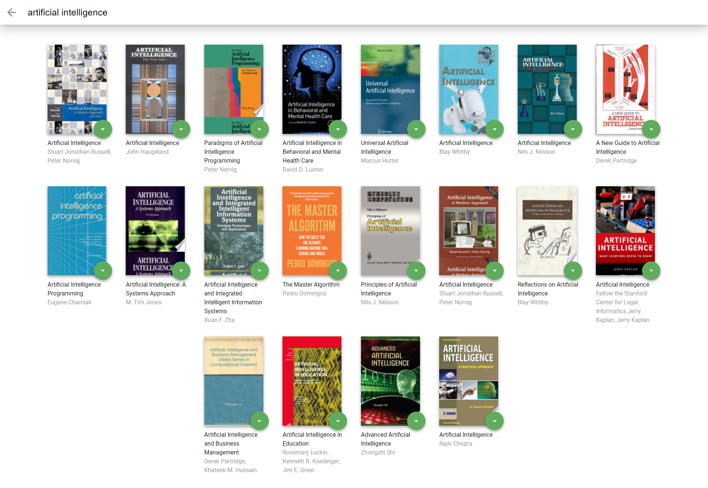

# Typing speed game


## Table of contents

- [Overview](#overview)
- [Screenshot](#screenshot)
- [Links](#links)
- [Built with](#built-with)
- [Author](#author)


## Overview

this is a project for Udacity's React Fundamentals course.

in this project you can:
- manage your books on different shelves
- move book from one shelf to another
- Search for new books 
- add new books to your shelves

## Screenshot





## Installation


1. Clone the repo
   ```sh
   git clone https://github.com/mohamedkhaled4053/my-reads.git
   ```
2. Install NPM packages
   ```sh
   npm install
   ```
3. start with 
   ```sh
   npm start
   ```


## Built with

- react.js
- Semantic HTML5 markup
- CSS custom properties
- Flexbox
- CSS Grid
- Javascript
- Mobile-first workflow

## Author

- linkedin - [mohamed khaled](https://www.linkedin.com/in/mohamed-khaled-58602722b/)
- Github - [mohamed khaled](https://github.com/mohamedkhaled4053)